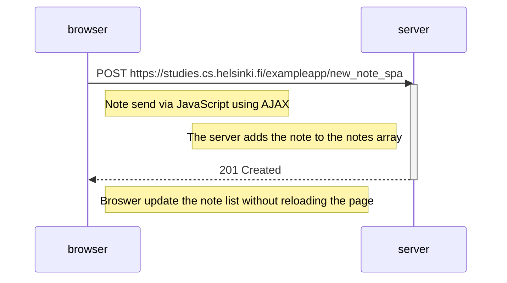

```mermaid
sequenceDiagram
    participant browser
    participant server

    browser->>server: POST https://studies.cs.helsinki.fi/exampleapp/new_note_spa
    activate server
    Note right of browser: Note send via JavaScript using AJAX
    
    Note left of server: The server adds the note to the notes array
    server-->>browser: 201 Created
    deactivate server
    Note right of browser: Broswer update the note list without reloading the page

```